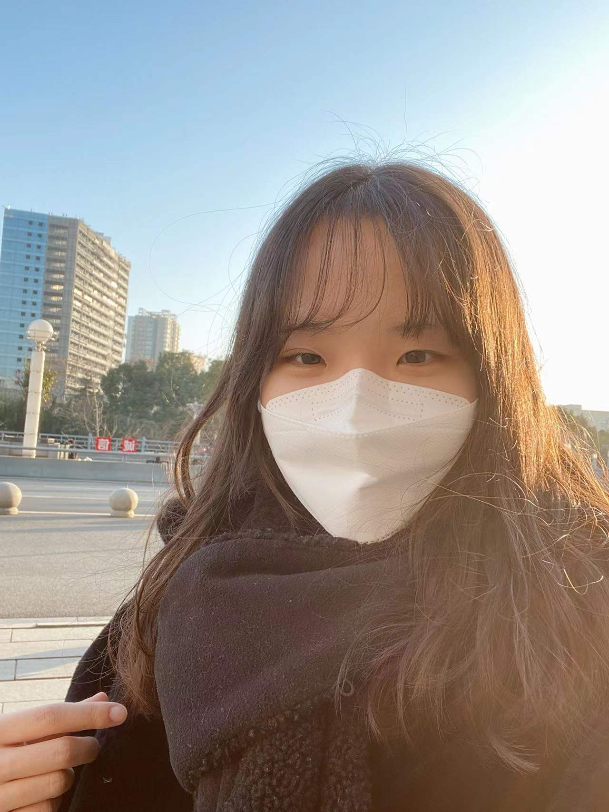

## WELCOME TO HYEONGEUN'S PROFILE

Hi, i'm HyeongEun, I'm from Korea.   

I came to China in 2018.    
Before coming to China, I learned Chinese for about 5 years.    
So I was interested in Chinese language and culture and decided to study in China.   

This is me.   
   

I love treveling. In china, I have been to Guilin, Chongqing, Shanghai, Chongqing huoguo and noodles are very delicious, and Hongya-dong is very magical.Shanghai is a very busy city, and I like it very much.   

I went to shanghai during the winter vacation. This is a picture I took in front of 东方明珠.      
   

My biggest hobby is cooking, and I am especially interested in various foods from various countries, and I usually study the menu to make my menu more delicious.   

<!--

**Here are some ideas to get you started:**

🙋‍♀️ A short introduction - what is your organization all about?
🌈 Contribution guidelines - how can the community get involved?
👩‍💻 Useful resources - where can the community find your docs? Is there anything else the community should know?
🍿 Fun facts - what does your team eat for breakfast?
🧙 Remember, you can do mighty things with the power of [Markdown](https://docs.github.com/github/writing-on-github/getting-started-with-writing-and-formatting-on-github/basic-writing-and-formatting-syntax)
-->
